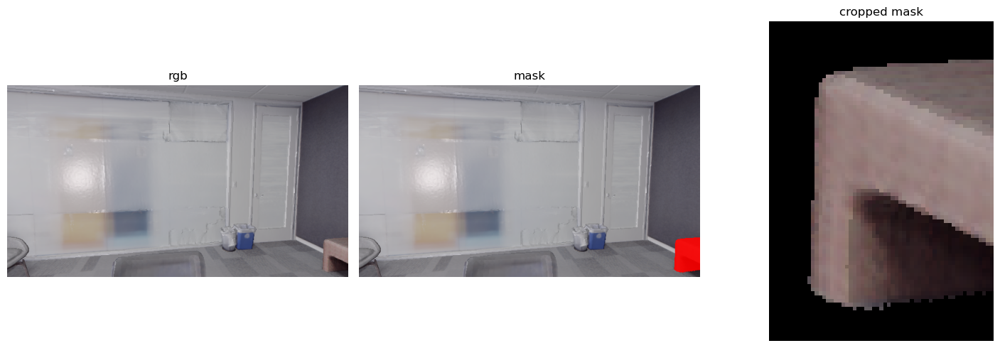
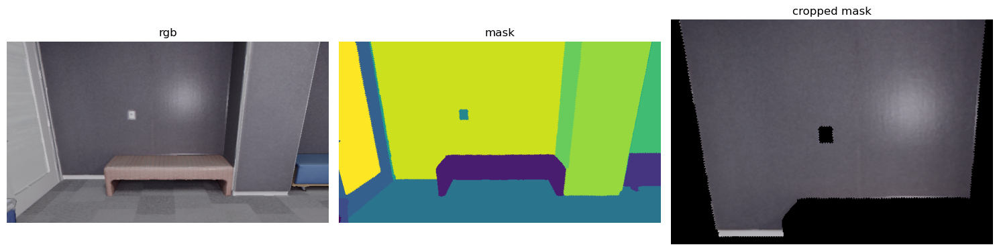
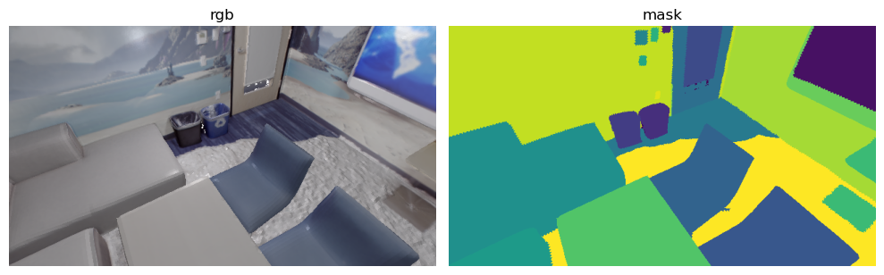

<div align="center">

## A VLM-Based Approach for 2D Mask Grouping Across Views
<!-- ### Machine Learning for 3D Geometry -->

### 🛠️ Built With

[](https://pytorch3d.org/)
[](https://github.com/unslothai/unsloth)
[](https://huggingface.co/docs/transformers/index)
[](https://numpy.org/)
[](https://pytorch.org/)
[](https://trimesh.org/)
[](https://docs.pydantic.dev/)

</div>

<div align="center">
<a href="">Saro Harutyunyan</a>, <a href="">Edoardo Calderoni</a>, <a href="">Valentin Brevet</a>

Technical University of Munich
</div>

<div align="center">

[](https://github.com/saro2808/ML43Dproject/blob/main/project_report/main.pdf)

</div>

### Abstract

We explore the use of large Vision-Language Models (VLMs) for the task of cross-view 2D instance mask grouping,
aiming to associate object masks observed in multiple camera views into consistent 3D instances. Using the Replica
indoor dataset, we formulate mask grouping as a binary visual reasoning problem: given two cropped instance masks
from different views, determine whether they correspond to the same underlying 3D object. We establish a baseline
using the pretrained Qwen3-VL model and subsequently fine-tune it using LoRA adapters, without modifying the base
model weights. Our experiments on held-out scenes demonstrate that LoRA fine-tuning improves mask ID consistency
highlighting the potential of VLMs without explicit 3D reasoning at inference time.

### Qualitative results

<div align="center">
    
    
    A pair of bench-sofa and wall with similar visible shapes misclassified by the base Qwen3-VL but correctly discriminated by the fine-tuned one
</div>

### Quantitative results

| **Scene** | **Model** | **Accuracy** | **Precision** | **Recall** |
| :--- | :--- | :---: | :---: | :---: |
| office4 | Base Qwen3-VL | 0.74 | 0.67 | 0.88 |
| office4 | LoRA-tuned | 0.82 | 0.76 | 0.92 |
| room2 | Base Qwen3-VL | 0.80 | 0.76 | 0.91 |
| room2 | LoRA-tuned | 0.92 | 0.91 | 0.94 |

## Repository organization

| **File/Directory** | **Content** |
| :--- | :--- |
| `results/qwen3vl_eval` | Evaluation results of base and fine-tuned Qwen3-VL-8B |
| `scripts/` | Bash scripts to encapsulate source code from the users |
| `src/` | Source code of the project |
| `Visualizations.ipynb` | Visualizations used in the [report](https://github.com/saro2808/ML43Dproject/blob/main/project_report/main.pdf) and this README |

## Setup

To install the necessary frameworks run
```bash
conda create -n ml43d_vlm python=3.12 -y
conda activate ml43d_vlm
bash scripts/setup.sh
```
**Note**. For preprocessing we use local environment with Python 3.11 and NumPy 1.26.4. However training and evaluation are done on Google Colab with Python 3.12 and NumPy 2.0.2 so beware of trimesh version.

## Dataset

We use the Replica dataset (5 office and 3 room scenes) which can be downloaded from [here](https://github.com/aminebdj/OpenYOLO3D/blob/main/scripts/get_replica_dataset.sh). We locate this at `data/replica` directory. It is structured as follows:
```
.
├── ground_truth
│   ├── office0.txt
│   ├── ...
│   ├── office4.txt
│   ├── room0.txt
│   ├── ...
│   └── room2.txt
├── office0
│   ├── color
│   │   ├── 0.jpg
│   │   ├── 1.jpg
│   │   └── ...
│   ├── depth
│   │   ├── 0.png
│   │   ├── 1.jpg
│   │   └── ...
│   ├── intrinsics.txt
│   ├── office0_mesh.ply
│   └── poses
│       ├── 0.txt
│   │   ├── 1.jpg
│       └── ...
├── office1
│   ├── color/
│   ├── depth/
│   ├── intrinsics.txt
│   ├── office1_mesh.ply
│   └── poses/
...
```
We preprocess the data by
```bash
bash scripts/preprocess_data.sh
```
producing the directory `data/processed` with the following structure:
```
.
├── office0
│   ├── 0
│   │   ├── instance_mask.npy
│   │   ├── rgb.png
│   │   └── unique_instances.npy
│   ├── 1
│   │   ├── instance_mask.npy
│   │   ├── rgb.png
│   │   └── unique_instances.npy
│   ├── ...
├── office1
│   ├── 0
│   │   ├── instance_mask.npy
│   │   ├── rgb.png
│   │   └── unique_instances.npy
│   ├── ...
...
```
<div align="center">
    
    <code>rgb.png</code> and <code>instance_mask.npy</code> of <code>office0/0</code> visualized
</div>

## Training

Before training we fill in the configs `base.json` and `train.json` in `src/configs` with our hyperparameters and paths. Then we run
```bash
bash scripts/train.sh
```

## Evaluation

Before evaluation we fill in the configs `base.json` and `eval.json` in `src/configs` with our hyperparameters and paths. Then we run
```bash
bash scripts/evaluate.sh
```